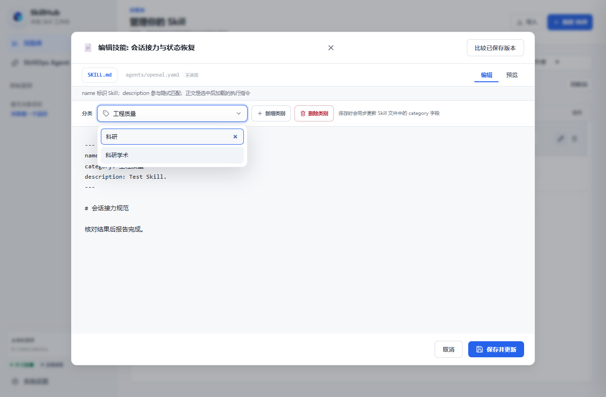
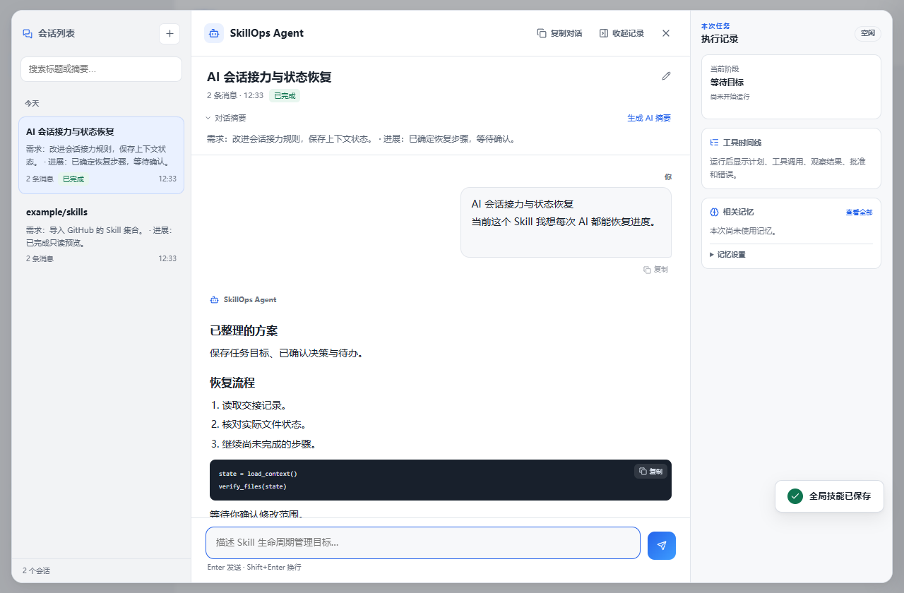
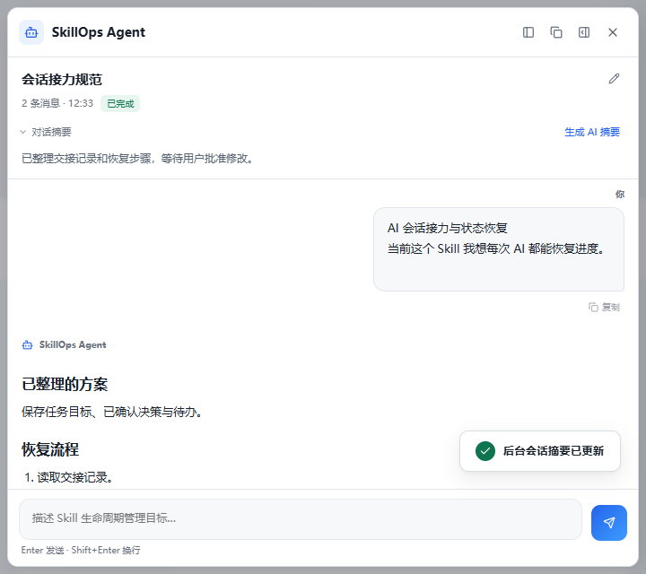

# SkillHub 3.6.2

本次更新包含 3.6.0 之后的功能修复、同步性能优化和会话工作区改进。

## 功能与恢复

- 删除失败时保留可恢复的 Skill 和元数据快照，避免回滚失败后清理剩余副本。
- 导入应用前校验实际待安装内容的哈希；单文件、目录与集合失败时一起恢复资产、索引和导入记录。
- Agent 根据已有 Skill 标识修改标准包入口，新建 Skill 使用标准包布局。
- 模型响应截断或为空时报告任务未完成；同步计划再次变化时重新要求预览确认。
- 设置中的目录选择与连接测试使用草案，保存配置时统一提交；过期列表响应不会覆盖新状态。
- 同步预览和状态比较共用资源过滤规则。

## Agent 与会话

- 官方 DeepSeek 接口默认使用 `deepseek-flash`，并支持关闭、低、高、最高思考强度。旧官方模型名称会在保留配置备份后迁移，自定义网关配置保持原模型名。
- 工具轮次保留协议要求的思考字段，公开任务和运行记录只展示模型、用量及经过筛选的状态信息。
- 会话列表显示可读标题、概览、消息数、时间和运行状态，支持标题或摘要搜索、重命名及加载更多。
- 默认在本地整理需求与最新进展；点击“生成 AI 摘要”可调用已配置服务生成标题和摘要。摘要不会替换聊天正文，旧记录可直接读取。
- 改进消息排版、复制、阅读位置保持、“回到最新”、停止按钮及窄窗口会话导航。
- Skill 分类改为可搜索的应用内面板，支持方向键、Enter、Esc 和 Tab。

## 界面示例

以下使用示例 Skill 和模拟会话展示 3.6.2 界面，不包含真实聊天或技能库数据。

## 性能

同步预览先检查项目中实际存在的旧副本，仅对候选内容计算哈希。一个选中 Skill、300 个测试包、每包 10 个资源的本机基准中，三次中位数从约 3.75 秒降至 0.124 秒，源文件哈希调用从 3300 次降至 11 次。该测量不包含界面渲染和模型请求。

重复项目状态查询可复用按文件签名失效的缓存；应用同步仍使用实时内容校验。

## 使用提示

在技能库编辑后保存原件；项目副本通过“预览并同步”更新，已发布的客户端副本通过“更新全局目标”更新。Agent 的写入、安装与同步继续要求绑定当前预览的明确审批。

## 验证

- 本地完整检查：158 项 Python 回归中 157 项通过、1 项因符号链接权限跳过；44 项前端测试和 12 项离线 Agent 评测通过。
- 完整页面交互验证覆盖分类搜索/键盘/保存、会话搜索与重命名、异步摘要归属、窄窗口导航和水平溢出；API 使用示例数据和模拟响应。
- Windows 便携产物与标签对应的提交一起发布，`BUILD_INFO.json` 记录构建提交、源码指纹和 EXE 哈希。

## 下载与校验

- `SkillHub.exe`：Windows 便携程序。
- `SHA256SUMS.txt`：程序 SHA-256 校验值。
- `BUILD_INFO.json`：构建来源和源码指纹。

发布页：[SkillHub 3.6.2](https://github.com/w1ndmiIl/skill_store/releases/tag/v3.6.2)。
